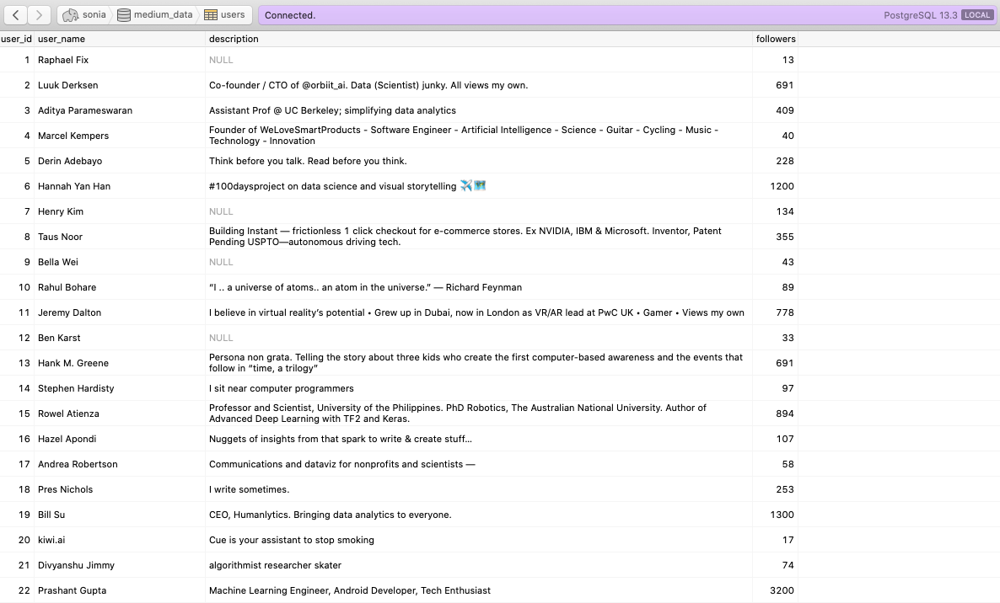
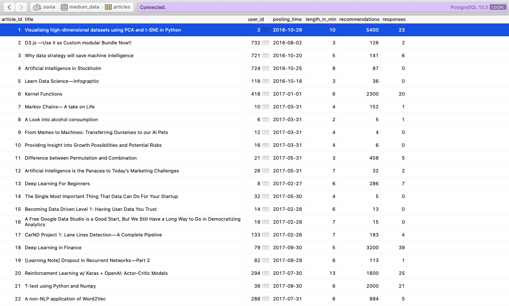
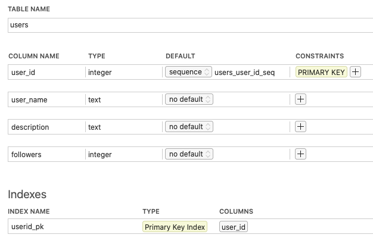
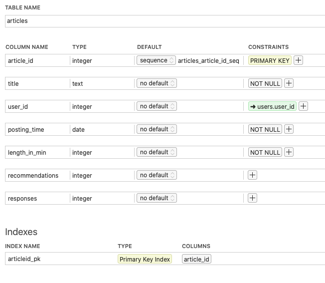

# Data Modeling with Postgres
||
|:--:|
|<b>As a data science lover, TowardsDataScience is one of my favourate hubs:blush:</b>|

## **Overview**
In this project, I applied Data Modeling with Postgres and build an ETL pipeline using Python. Data are collected in json format.


## **Stories Dataset**
[Stories dataset](https://github.com/xxionias/webscraping/tree/master/mediumstories) were 43185 stories web scraped from [TowardsDataScience](http://towardsdatascience.com). The articles were published from 2016/02 to 2021/05.

Sample Record :
```
{"author": "Luuk Derksen", "linkOfAuthorProfile": "https://towardsdatascience.com/@luckylwk?source=collection_archive---------0-----------------------", "articleTitle": "Visualising high-dimensional datasets using PCA and t-SNE in Python", "articleLink": "https://towardsdatascience.com/visualising-high-dimensional-datasets-using-pca-and-t-sne-in-python-8ef87e7915b?source=collection_archive---------0-----------------------", "postingTime": "Oct 29, 2016", "minToRead": "10 min read", "recommendations": "5.4K", "responses": "23 responses"}
```

## **Profile Dataset**
[Profile dataset](https://github.com/xxionias/webscraping/tree/master/mediumprofile) were web scraped from user profiles link from the stories dataset.

Sample Record :
```
{"user_name": "Luuk Derksen", "desc": "Co-founder / CTO of @orbiit_ai. Data (Scientist) junky. All views my own.", "followers": "691 Followers"}
```


#### Dimension Tables
**users**  - users profiles
```
user_id, user_name, description, followers
```
**articles**  - songs in music database
```
article_id, title, user_id, posting_time, length_in_min, recommendations, responses
```


## Project Files

```sql_queries.py``` -> contains sql queries for dropping and creating fact and dimension tables. Also, contains insertion query template.

```create_tables.py``` -> contains code for setting up database. Running this file creates **medium_data** and also creates the dimension tables.

```etl.ipynb``` -> a jupyter notebook to analyse dataset before loading. 

```etl.py``` -> read and process **stories_data** and **profile_data**

## Output Postgres Database  
|  |
|:--:|
| <b>The `users` table has 16529 entries</b> |

|  |
|:--:|
| <b>The `articles` table has 3908 entries</b> |

|  |
|:--:|
| <b>`user_id` is the primary key</b> |

|  |
|:--:|
| <b>`article_id` is the primary key and `user_id` is a foreign key</b> |


GUI Tool Used Here - [Postico](https://eggerapps.at/postico/)

## Environment 
Python 3.6 or above

PostgresSQL 9.5 or above

psycopg2 - PostgreSQL database adapter for Python


## How to run

Run the drive program ```main.py``` as below.
```
python main.py
``` 

The ```create_tables.py``` and ```etl.py``` file can also be run independently as below:
```
python create_tables.py 
python etl.py 
```
